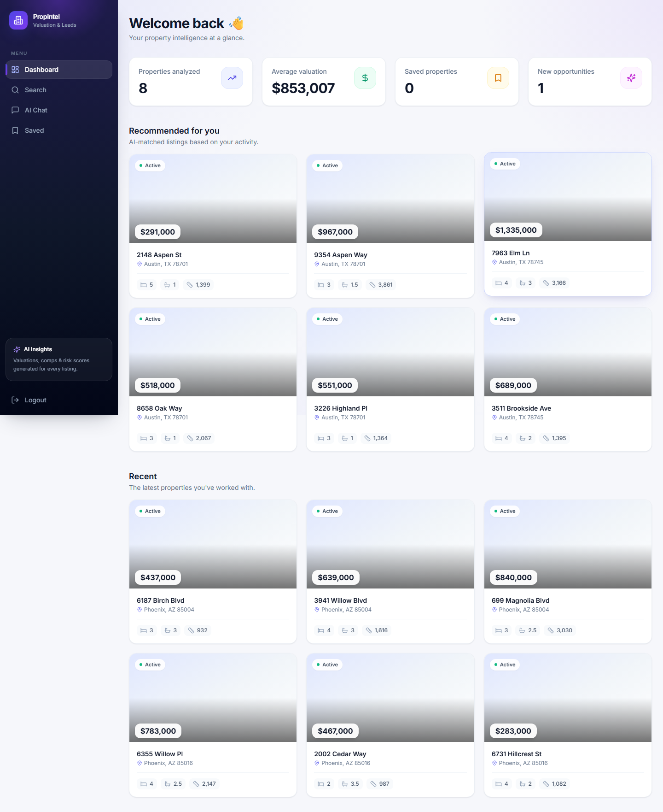
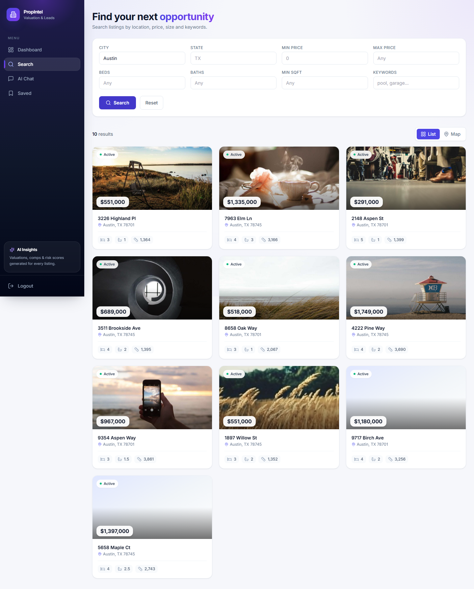
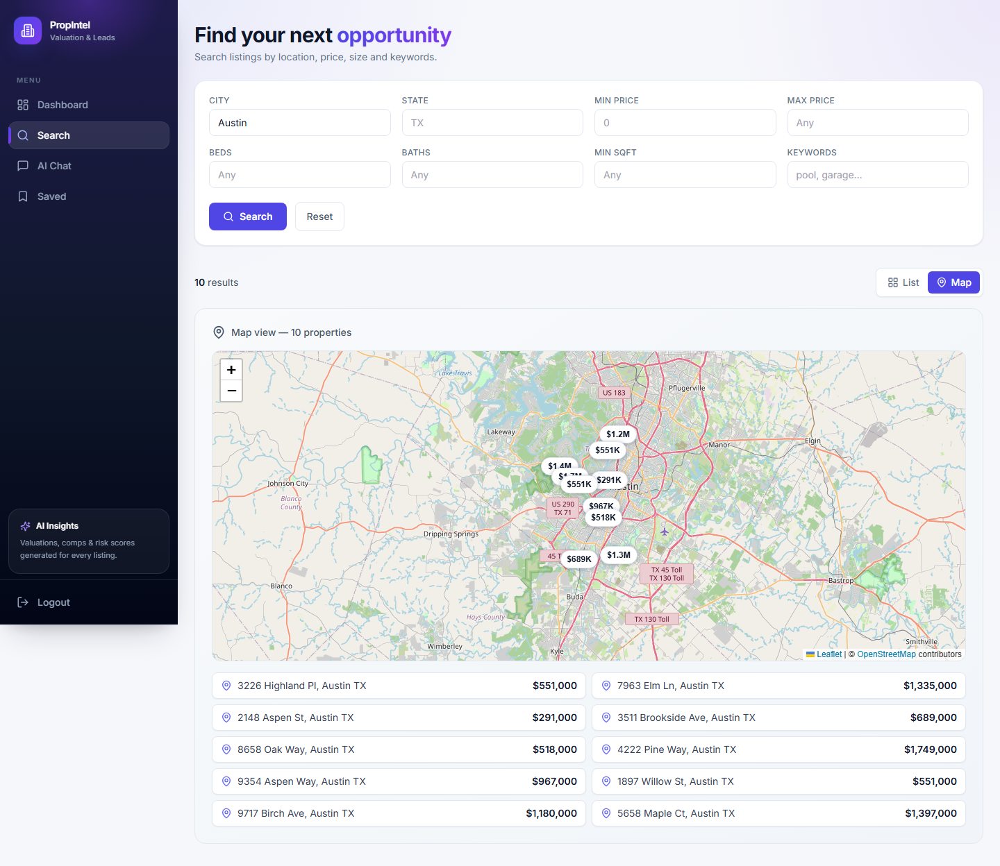
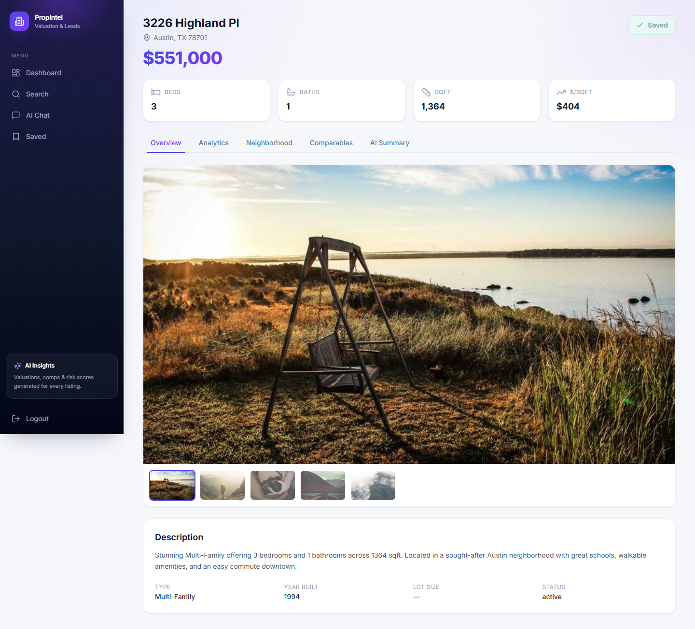
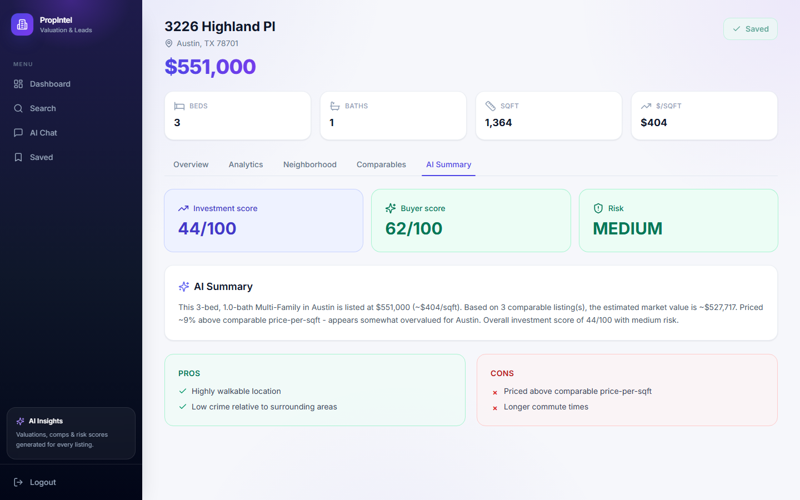
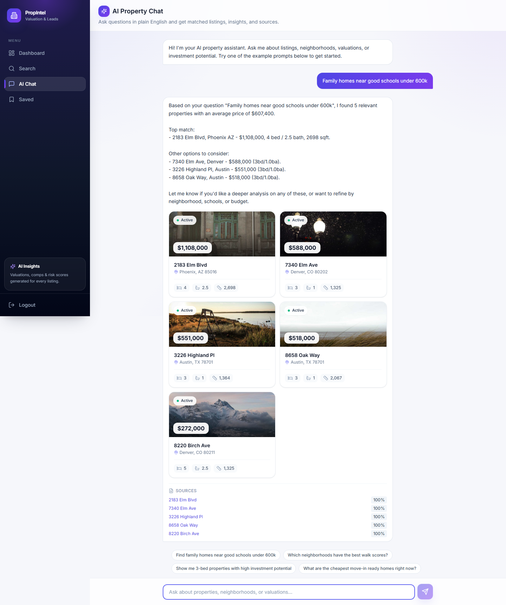
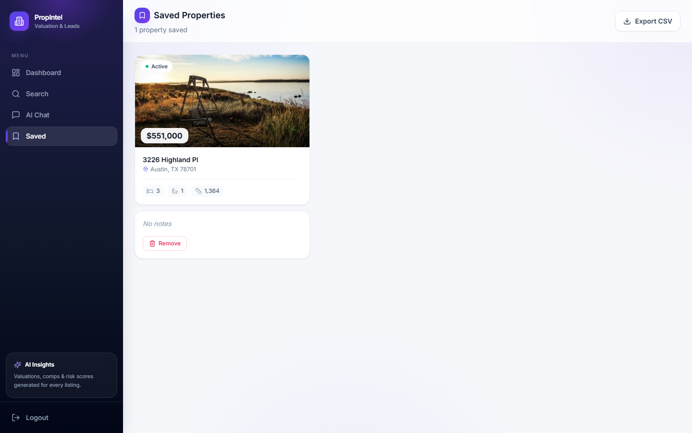
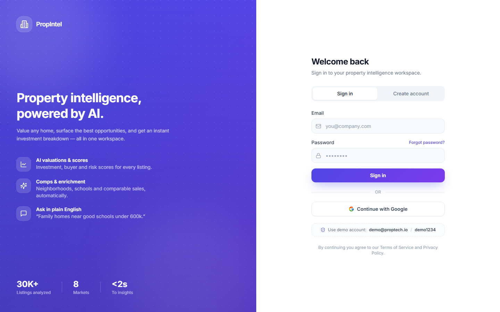

# AI-Powered Property Valuation & Lead Intelligence Platform

A full-stack proptech application that turns raw listing data into **actionable
buying and investing intelligence**. It ingests property data (RentCast / MLS),
enriches it with neighborhood signals (Google Maps), generates AI valuations and
investment analysis (OpenAI), and exposes it through a semantic-search +
RAG-chat experience with a clean React dashboard.

---

## Problem Statement

Home buyers, investors, and agents are drowning in listings but starved for
*judgment*. The raw fields on a listing (price, beds, sqft) don't answer the
questions that actually matter:

- Is this **priced fairly** versus comparable homes?
- What's the **investment upside** and **risk**?
- How good is the **neighborhood** — schools, walkability, commute, safety?
- Out of thousands of listings, **which ones fit me**, and can I just *ask*?

This platform answers those questions automatically. It computes comparable-sales
statistics, produces an AI valuation with pros/cons and an investment score,
scores neighborhoods, recommends properties per user, and lets users query the
inventory in natural language via retrieval-augmented chat over vector embeddings.

---


## Tech Stack

| Layer        | Technology |
|--------------|------------|
| Frontend     | Next.js 14 (App Router), React 18, TypeScript, Tailwind CSS, @tanstack/react-query, axios, lucide-react |
| Backend      | FastAPI, Python 3.11, async SQLAlchemy 2.x (asyncpg), Pydantic v2 + pydantic-settings |
| Auth         | python-jose JWT (HS256), passlib[bcrypt] password hashing |
| AI / Vectors | OpenAI (`text-embedding-3-small` 1536-d, `gpt-4o-mini`), pgvector |
| Data / infra | Postgres 16 + pgvector, Redis 7, Celery, httpx, Docker Compose |

---

## Features

- **A. Property Search** — filterable search (`city`, `state`, price range,
  beds, baths, min sqft, keywords) with pagination; returns typed results + total.
- **B. AI Valuation & Analysis** — per-property AI summary, pros/cons,
  investment score (0–100), risk score (low/med/high), buyer-fit score,
  price evaluation, and estimated value, persisted to the `analyses` table.
- **C. Comparable Sales** — nearest comparable listings plus stats
  (avg price, avg price/sqft, count, subject price/sqft) for fair-value context.
- **D. Neighborhood Intelligence** — school score, restaurants count, commute
  time, walk score, crime score, and nearby schools per property.
- **E. Personalized Dashboard & Recommendations** — analyzed-count, average
  valuation, saved count, new opportunities, recent properties, and
  per-user property recommendations.
- **F. Semantic RAG Chat** — natural-language queries answered over a
  pgvector embedding index, returning an answer plus the source properties.

Plus: JWT auth (register/login/refresh/me) and saved properties with notes/labels.

---

## Screenshots

> Captured against the stack running locally in **mock mode** (no external API keys),
> signed in as the seeded demo account.

### Dashboard — KPIs, recommendations & recent activity



### Search — filterable list & interactive map (Leaflet + OpenStreetMap)

| List view | Map view |
|-----------|----------|
|  |  |

### Property detail — gallery, stats & AI valuation

| Overview | AI Summary (scores, pros/cons) |
|----------|--------------------------------|
|  |  |

### Semantic RAG chat — ask in plain English, grounded in the inventory



### Saved properties & sign-in

| Saved | Sign in |
|-------|---------|
|  |  |

---

## Quickstart

Prerequisites: **Docker** + **Docker Compose** (and optionally `make`).

```bash
# 1. Configure (mock mode is on by default — no keys needed)
cp .env.example .env

# 2. Build and start db, redis, backend, worker, frontend
make up
```

The backend **auto-seeds** mock data on first startup (≈30 listings across
Austin / Denver / Phoenix, AI analyses for several, and a demo user). Give it
~30–60s after the stack is healthy. You can re-run the seed manually any time
(it's idempotent) with `make seed`.

Then open:

- **Frontend:** http://localhost:3000
- **API docs (Swagger):** http://localhost:8000/docs
- **Health:** http://localhost:8000/api/health

**Demo login:** `demo@proptech.io` / `demo1234` (created by the seed).

Without `make`, the equivalent commands are:

```bash
cp .env.example .env
docker compose up --build -d
# optional (auto-seed already runs on startup):
docker compose exec backend python -m app.seed
```

### Host ports

The frontend (`3000`) and API (`8000`) are published on their standard ports.
To avoid clashing with a **native Postgres/Redis already running on the host**,
the database and cache are published on non-default host ports (the containers
still talk to each other on the internal `5432`/`6379`):

| Service  | Host port | Container port |
|----------|-----------|----------------|
| Postgres | **5433**  | 5432           |
| Redis    | **6380**  | 6379           |

So to connect a local client: `psql -h localhost -p 5433 -U postgres proptech`.

### Troubleshooting

- **`docker compose up` hangs at "Starting" / `docker ps` becomes unresponsive
  (Docker Desktop + WSL2):** almost always a **host port already in use**. Check
  with `Get-NetTCPConnection -LocalPort 5432,6379,8000,3000` (PowerShell). Stop
  the conflicting service or change the host port mapping in `docker-compose.yml`.
- If the engine is wedged, restart it (`docker desktop restart`); a full reset is
  `wsl --shutdown` then relaunch Docker Desktop.

---

## Mock Mode & Plugging In Real Keys

The app is designed to be **fully runnable with no external accounts**.

**The mock fallback rule:** if `USE_MOCK_DATA=true` *or* the relevant API key is
empty, the external clients return deterministic mock data and the AI service
returns canned-but-plausible responses — **no network calls are made**.

- **RentCast** → if `RENTCAST_API_KEY` is empty (or mock mode), property/comp
  data comes from the seeded mock dataset.
- **Google Maps** → if `GOOGLE_MAPS_API_KEY` is empty (or mock mode),
  neighborhood signals (school/walk/crime scores, commute, restaurants) are
  generated deterministically.
- **OpenAI embeddings** → if `OPENAI_API_KEY` is empty (or mock mode), a
  **deterministic pseudo-vector** is derived from a hash of the text (1536
  floats), so vector search works identically across runs.
- **OpenAI chat / analysis** → returns canned-but-plausible summaries, pros/cons,
  and scores so every feature is demonstrable.
- **Map (frontend)** → the Search → **Map** view renders an interactive map
  (Leaflet + OpenStreetMap tiles) with a price pin per result; click a pin for an
  address/price popup and a link to the detail page. It needs **no API key, token,
  or account** — OpenStreetMap tiles are free to use.

**To use real data**, set `USE_MOCK_DATA=false` in `.env` and provide whichever
keys you have:

```env
USE_MOCK_DATA=false
RENTCAST_API_KEY=your_rentcast_key
GOOGLE_MAPS_API_KEY=your_google_maps_key
OPENAI_API_KEY=sk-...
```

Keys are independent — you can supply only `OPENAI_API_KEY` (real AI + real
embeddings) while still mocking RentCast/Google, because each client checks its
own key before deciding to use the mock path.

---

## API Reference

All endpoints are under the `/api` prefix and return JSON. All require a
`Authorization: Bearer <token>` header **except** `auth/register` and `auth/login`.

| Method | Path | Auth | Description |
|--------|------|------|-------------|
| POST   | `/api/auth/register` | — | Register → `{access_token, token_type, user}` |
| POST   | `/api/auth/login` | — | Login → `{access_token, token_type, user}` |
| POST   | `/api/auth/refresh` | Bearer | Issue a fresh access token |
| GET    | `/api/auth/me` | Bearer | Current user |
| GET    | `/api/properties/search` | Bearer | Filtered search → `{results, total}` |
| GET    | `/api/properties/{id}` | Bearer | Property (embeds neighborhood + analysis) |
| GET    | `/api/properties/{id}/comparables` | Bearer | `{comparables, stats}` |
| GET    | `/api/properties/{id}/analysis` | Bearer | Stored analysis |
| POST   | `/api/properties/analysis` | Bearer | Generate + persist analysis |
| GET    | `/api/dashboard/summary` | Bearer | KPIs + recent properties |
| GET    | `/api/dashboard/recommendations` | Bearer | Recommended properties |
| POST   | `/api/chat/query` | Bearer | RAG chat → `{answer, properties, sources}` |
| GET    | `/api/saved` | Bearer | Saved properties (with embedded property) |
| POST   | `/api/saved` | Bearer | Save a property `{property_id, notes?, label?}` |
| DELETE | `/api/saved/{id}` | Bearer | `{ok: true}` |
| GET    | `/api/health` | — | `{status: "ok"}` |

Search query params: `city, state, min_price, max_price, beds, baths, min_sqft,
keywords, limit=20, offset=0`.

---

## Data Pipeline

Ingestion and enrichment run as **Celery tasks** (broker + backend = Redis), so
heavy I/O never blocks API requests:

1. **Ingest** — pull listings from RentCast (or mock dataset) and upsert into
   `properties` by `external_id`.
2. **Enrich neighborhood** — call Google Maps (or mock) to compute school,
   walk, crime scores, commute time, restaurant count, and nearby schools;
   write to `neighborhoods` (1:1 with property).
3. **Embed** — build a descriptive text blob per property (address, type, beds,
   sqft, description, neighborhood signals), embed it (OpenAI or hash fallback),
   and store the 1536-d vector in `properties.embedding` for semantic search.
4. **Analyze (on demand)** — `POST /api/properties/analysis` computes comparable
   stats and produces the AI valuation/analysis, persisted to `analyses`.

For the MVP, schema is created on startup via `Base.metadata.create_all`
(no Alembic). `make seed` runs the pipeline against the deterministic mock
dataset so the whole experience is reproducible.

---

